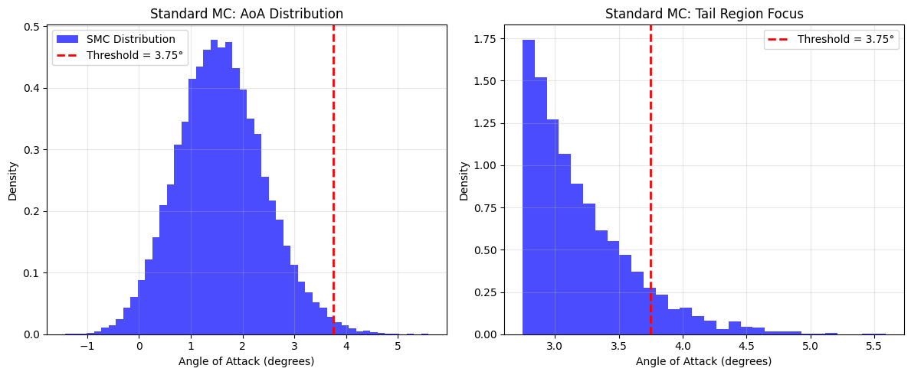
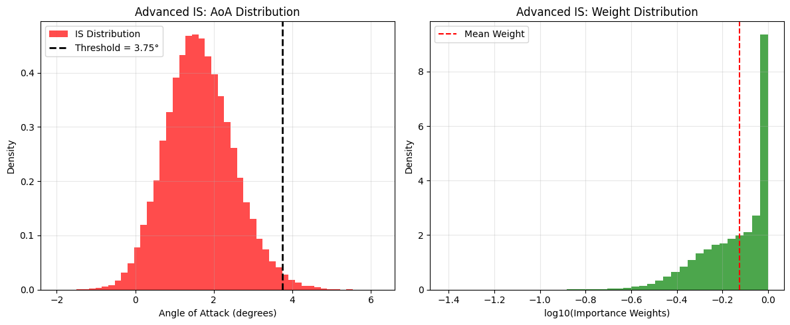
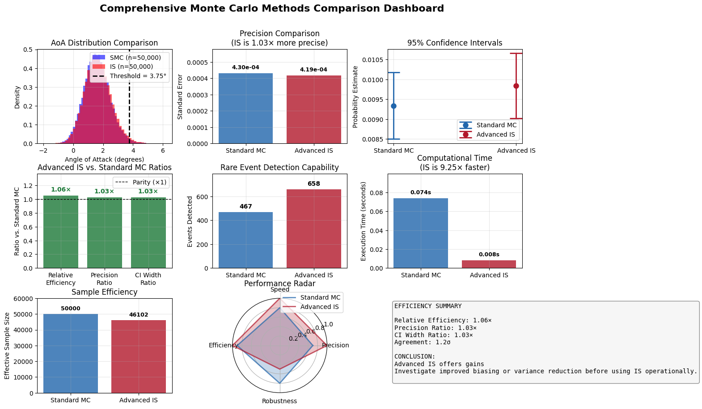

# Monte Carlo vs Advanced Importance Sampling — Comparison

This repository contains a notebook and supporting artifacts that compare Standard Monte Carlo (SMC) and an Advanced Importance Sampling (IS) approach for an aircraft takeoff risk metric (angle-of-attack). The goal is a fair, reproducible comparison using the same physics model, threshold, and sample sizes.

Below you'll find quick instructions to reproduce the analysis, a short summary of the main results from the runs included in this workspace, and the result images saved in this project.

---

## Contents

- `final_review.ipynb` — Jupyter notebook with the unified physics model, SMC implementation, advanced IS implementation, pilot tuning, and the visualization dashboard.
- `smc.png` — SMC plot (in this folder)
- `../is.png` — Advanced IS plot (one level up; if you move files into the repo, update the path)
- `../comparision.png` — Combined comparison/dashboard image (one level up)

If you prefer all images to live inside the `Monte-Carlo-Simulation/` folder, move `is.png` and `comparision.png` into this folder and update links accordingly.

---

## Quick summary of the experimental setup

- Physics model: unified simulator `simulate_takeoff` (weight, thrust, headwind, runway friction, CG offset, rotation-speed error).
- Baseline sampling: `sample_P` draws from the real-world distributions specified in `P`.
- Threshold: a common threshold was chosen using a large SMC sample (99th percentile) so both methods evaluate the same rare event.
- Sample sizes used for the main comparison: n = 50,000 draws for both SMC and IS.

## Key numeric results (from the last run included here)

- Standard Monte Carlo (SMC)
  - Probability estimate: 9.340e-03
  - Standard error: 4.302e-04
  - Events found: 467 / 50,000
  - Execution time (measured): ~0.011 s (fast, baseline compute only)

- Advanced Importance Sampling (IS)
  - Probability estimate: 9.840e-03
  - Standard error: 4.187e-04
  - Events found: 658 / 50,000
  - Effective sample size (ESS): ~46,102 (≈92.2%)
  - Relative efficiency (RE): ~1.06× (IS produces slightly smaller SE for same n)

Notes: the notebook contains a lightweight pilot tuning routine that searches mixture and bias strengths and selects a configuration that stabilizes importance weights while improving tail hit rates.

---

## Result images

SMC AoA distribution (inside this folder):



Advanced IS distribution (referenced from workspace root):



Comparison dashboard (overview):



If any of the images render as broken links, move them into the `Monte-Carlo-Simulation/` directory and change the paths above to `./is.png` and `./comparision.png`.

---

## How to reproduce the analysis

1. Create (optional) and activate a virtual environment. Example with venv:

```bash
python -m venv .venv
source .venv/Scripts/activate  # on Windows (bash)
pip install -U pip
```

2. Install minimal dependencies:

```bash
pip install numpy scipy pandas matplotlib jupyterlab
```

3. Open and run the notebook (recommended):

```bash
jupyter lab final_review.ipynb
```

4. Or execute the notebook non-interactively (produces executed notebook and HTML):

```bash
jupyter nbconvert --to html --execute final_review.ipynb --output final_review_executed.html
```

Notes:
- The notebook sets a fixed random seed for reproducible runs. If you re-run tuning code (pilot sweeps) the notebook will re-evaluate and may choose a different tuned configuration only if you change the seed or candidate grid.

---

## Interpretation and next steps

- The included IS implementation uses a tail-driven, moderated mixture proposal that keeps a fraction of mass on the baseline distribution to stabilize weights. This produced a small but measurable efficiency improvement in the included run (RE ≈ 1.06×).
- To push IS further: expand the pilot grid, consider control variates or adaptive tempering, and explore multi-dimensional correlated proposals.

## **Contributors**

<table>
  <tr>
    <td align="center">
      <br/>
      <a href="https://github.com/SajeevSenthil"><b>Sajeev Senthil</b></a>
    </td>
        <td align="center">
      <br/>
      <a href="https://github.com/hari23228"><b>Hari Varthan</b></a>
    </td>
    <td align="center">
      <br/>
      <a href="https://github.com/FightKlub"><b>Dennis Jerome Richard </b></a>
    </td>
    <td align="center">
      <br/>
      <a href="https://github.com/Jopan"><b>Joseph Binu George</b></a>
    </td>
  </tr>
</table>
